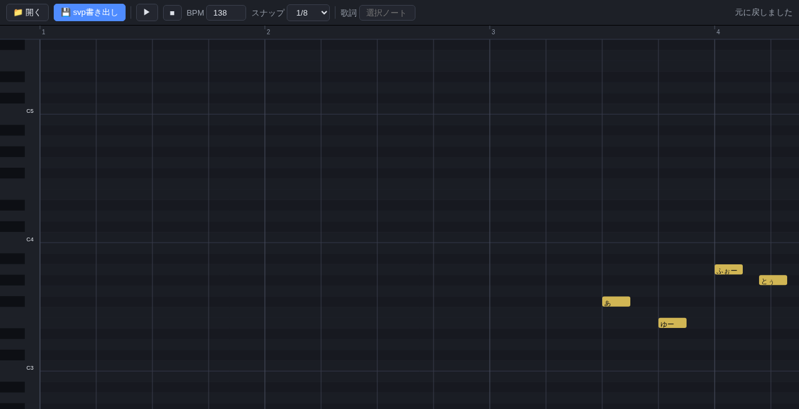

# svp-lyric-editor

Synthesizer V (`.svp`) プロジェクトをブラウザで閲覧・編集する**単一HTML**ツール。
ビルド不要・サーバ不要・完全ローカル動作。**ファイルはどこにも送信されません**（すべてブラウザ内で処理）。

A single-file HTML viewer/editor for Synthesizer V (`.svp`) projects.
No build step, no server, fully offline — **your files never leave your browser**.



## Features / 主な機能

- **完全ブラウザ完結** — `index.html` を開いて `.svp` をドラッグ&ドロップするだけ
- **ピアノロール編集** — ノート追加 / 移動 / 長さ変更 / 削除 / 複数選択 / Undo・Redo
- **歌詞編集**
  - ノートをダブルクリック or 右クリック → ノート脇のポップアップで入力
  - `Tab` / `Shift+Tab` で次のノートへ連続入力
  - **まとめ歌詞**: 複数ノート選択 → 一括で歌詞を順番割当（スペース/改行区切り・1文字ずつの切替）
  - **音素自動生成**: かな歌詞 → Synthesizer Vローマ字音素表(JapaneseROMAJI)準拠で自動変換
- **再生プレビュー** — Web Audio API の矩形波で試聴（全トラック・メトロノーム・追従スクロール付き）
- **3つのビュー構成**（リサイズ可能 / 非表示切替あり）
  - **ピアノロール**（メイン）— ノート編集の中心。縦軸=音程・横軸=時間
  - **全体ビュー** — 曲全体を俯瞰。クリック/ドラッグでメインの表示範囲を移動
  - **歌詞ストリップ** — 全ノートの歌詞を帯状に表示し、追従スクロールで再生中の歌詞を確認・編集
- **複数トラック対応** — Synthesizer V 1 / 2 の .svp 構造に対応、トラックごとに色分け
- **自動保存** — 編集内容を localStorage に自動保存（誤リロードに備える）
- **svp 書き出し** — 編集後そのまま `.svp` をダウンロード → Synthesizer V Studio で開ける（読み込んだ形式・バージョンのまま保存）

## Quick Start / 使い方

1. [index.html](./index.html) をダウンロードしてブラウザで開く（Chrome / Edge / Firefox / Safari 推奨）
2. `.svp` ファイルをドラッグ&ドロップ（またはツールバーの「開く」ボタン）
3. 編集して「svp書き出し」→ `<元ファイル名>_edited.svp` がダウンロードされる
4. Synthesizer V Studio で開いてレンダリング

```
動作確認済みブラウザ: Chrome (Chromium ベース)・Edge・Firefox・Safari (localStorage / AudioContext 必須)
```

## Key bindings / 操作早見表

| 操作 | キー / マウス |
|------|------------|
| トラック切替 | 左ペインのトラックをクリック |
| 範囲選択 | 空白ドラッグ（マーキー）/ `Shift+クリック` で追加・解除 |
| ノート追加 | 空白部分ダブルクリック（選択トラックに追加） |
| 歌詞/音素編集 | ノート**ダブルクリック or 右クリック** → ノート脇のポップアップ |
| 次の歌詞へ | ポップアップ内 `Tab`（`Shift+Tab` で前へ） |
| まとめ歌詞 | 複数選択 → 右クリック → ポップアップで一括割当（スペース/改行区切り・1文字ずつの切替） |
| 一括歌詞 | 複数選択してポップアップで入力 → Enter で全選択ノートに反映 |
| 移動 | ノートドラッグ（複数選択時はまとめて移動） |
| 長さ変更 | ノート左/右端ドラッグ |
| 削除 | `Del` / 切り取り `Ctrl+X` |
| 全選択 | `Ctrl+A`（選択トラックの全ノート） |
| 取り消し | `Ctrl+Z` / やり直し `Ctrl+Shift+Z` or `Ctrl+Y` |
| 再生 / 停止 | `Space`（矩形波プレビュー・全トラック） |
| 追従切替 | `F` |
| コピー / ペースト | `Ctrl+C` / `Ctrl+V`（ペーストは再生位置へ） |
| 複製 | `Ctrl+D` |
| 表示切替 | ツールバー「表示: 歌詞⇔音素」 |
| シーク | ルーラークリック |
| 横スクロール | ホイール / トラックパッド横スクロール |
| 縦スクロール(音程) | `Shift+ホイール`（拡大時の上下移動） |
| ズーム | `Ctrl+ホイール` |
| 音程移動 | 矢印キー（スナップ量ずつ・複数可） |
| 選択解除 | `Esc` |

## Project structure / 構成

```
svp-lyric-editor/
├── index.html                # 本体（HTML+CSS+JS すべてこの1ファイル）
├── README.md
├── LICENSE
└── docs/
    ├── legal-notes.md                 # 権利関係・免責の詳細
    └── screenshot.png                 # スクリーンショット
```

## Implementation notes / 実装メモ

- **blick 単位**: Dreamtonics 公式に準拠 — `SV.QUARTER = 705,600,000` blicks = 1四分音符（BPM非依存の楽譜時間）。実ファイル検証済み（2分=1,411,200,000 / 16分=352,800,000 / 3連16分=294,000,000）
- **物理秒変換**: テンポマップ区間の線形補間（`secOf()` / `blickOf()` / 再生同期 `blickAtElapsed()`）
- **再生**: Web Audio API 矩形波（`square` osc、pitch→MIDI周波数変換）、lookahead 0.25s スケジューリング
- **編集**: プロジェクトJSONを直接書き換え。Undo は全体スナップショット（最大30段階）
- **音素自動生成**: ノートの `phonemes` が空欄なら SynthV 側が自動推定する仕様を活かし、かな→ローマ字音素を補完

## Supported formats / 対応形式

- Synthesizer V Studio `.svp`
  - **Synthesizer V 1** 形式（notes が `tracks[].mainGroup.notes` に直接入る構造）と **Synthesizer V 2** 形式（notes が `library[]` にあり `tracks[].mainRef/groups[]` が参照する構造）の両方を**実ファイルで検証済み**
- 複数トラック（`tracks[].mainRef/groups[]` 参照ごとに1インスタンスとして描画。`blickAbsoluteBegin/blickOffset/pitchOffset/mute` 反映）
- テンポマップ (`time.tempo`)・拍子 (`time.meter`)、複数小節変更グリッド
- 末尾NULパディング付き svp（Synthesizer V 1 世代）も自動読込
- 保存（書き出し）時は**読み込んだ JSON 構造をそのまま保持** — SynthV 1 形式で読めば SynthV 1 形式、SynthV 2 形式で読めば SynthV 2 形式のまま書き出される（バージョン変換は行わない）

## Known limitations / 既知の制限 (Phase 2 candidates)

- ピッチ曲線 (`parameters.pitchDelta`) の表示・編集は未対応
- 再生音は矩形波のみ（SoundFont 連携なし）
- 音声レンダリングは不可（編集結果は .svp として書き出し、SynthV Studio でレンダリング）

## License / ライセンス

MIT License — see [LICENSE](./LICENSE).

---

*This project is an independent viewer/editor for Synthesizer V project files and is not affiliated with Dreamtonics Co., Ltd. Synthesizer V is a trademark of Dreamtonics Co., Ltd. / 本ツールは Dreamtonics 株式会社の公式製品ではなく、同社とは無関係です。Synthesizer V は Dreamtonics 株式会社の商標です。詳細は [docs/legal-notes.md](./docs/legal-notes.md) を参照。*
